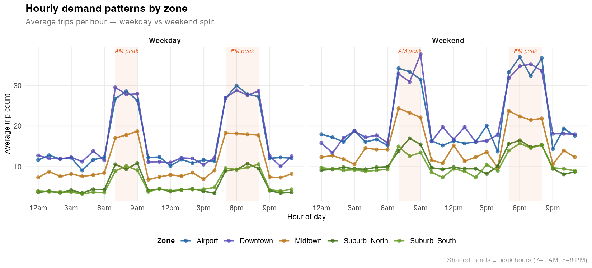
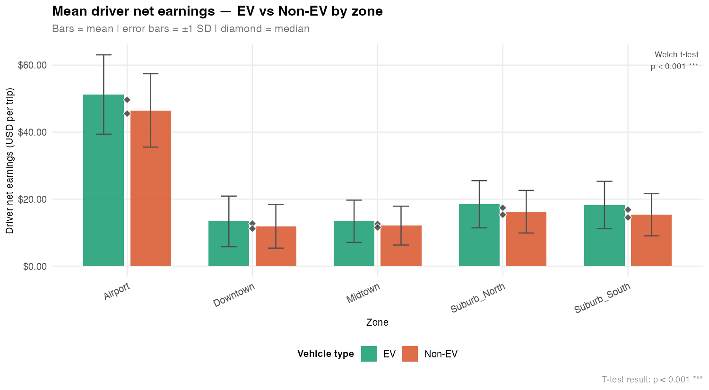
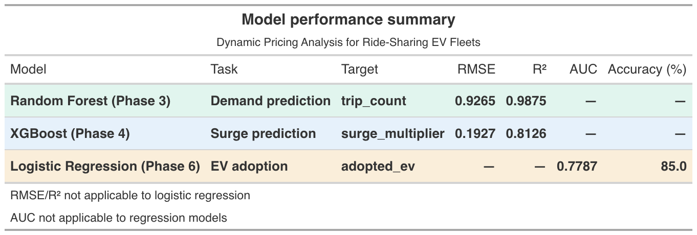
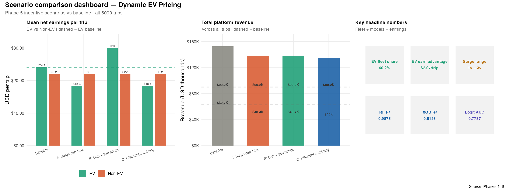
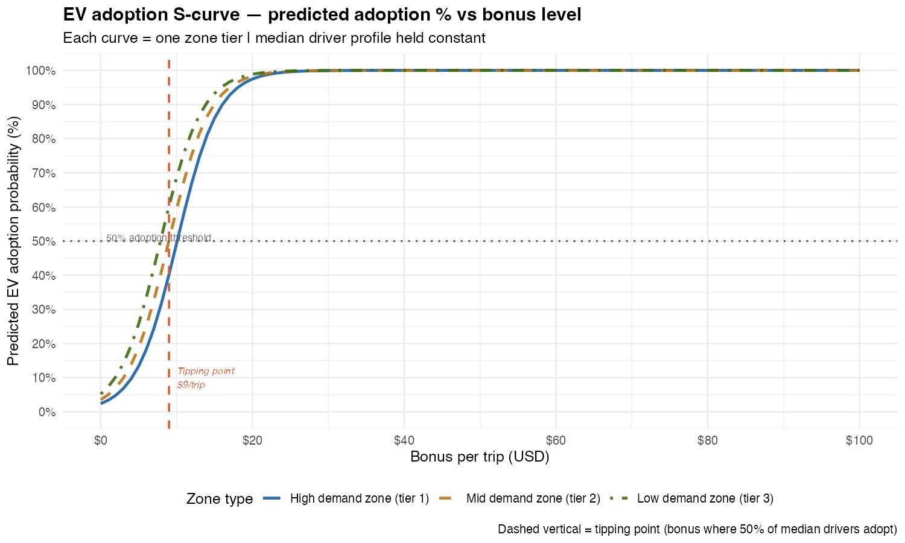
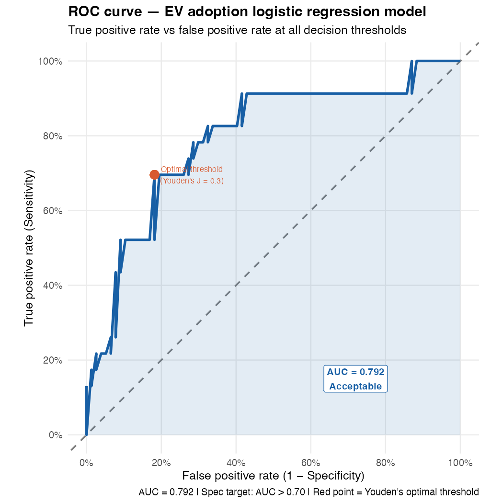
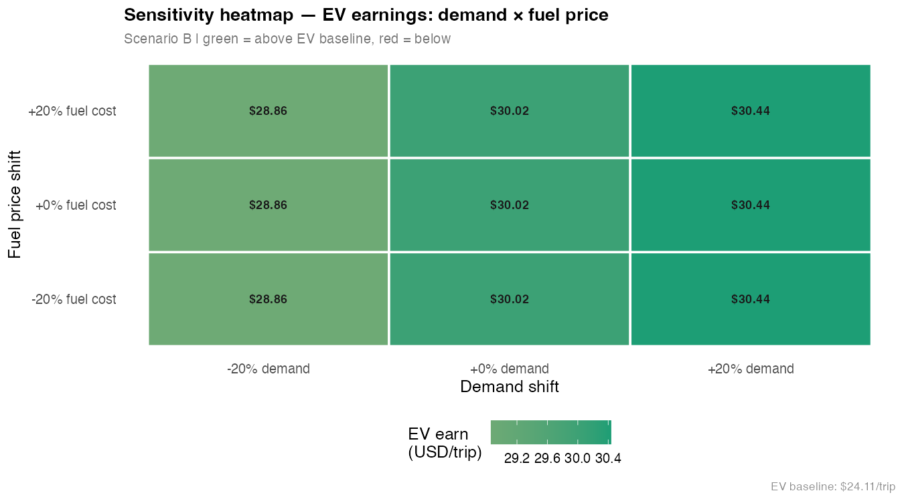

```{r setup, include=FALSE}
knitr::opts_chunk$set(echo=FALSE, warning=FALSE, message=FALSE,
                      fig.width=10, fig.height=5.5)
library(tidyverse); library(scales); library(patchwork); library(gt)
```

## 1. Dataset
```{r}
glimpse(read_csv("trips_data_with_surge_pred.csv", show_col_types=FALSE))
```

## 2. EDA
```{r, out.width="100%"}


```

## 3. Model performance
```{r, out.width="100%"}

```

## 4. Scenario comparison
```{r, out.width="100%"}

```

## 5. Adoption S-curve + ROC
```{r, out.width="100%"}


```

## 6. Sensitivity analysis
```{r, out.width="100%"}

```

## 7. Policy recommendation
> **Recommended: Scenario B** — see phase7_policy_recommendation.txt

